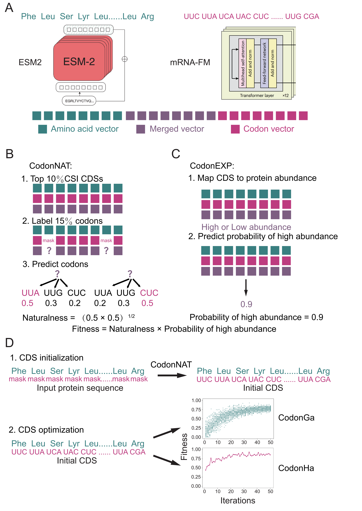

# HalluCodon: a species-specific codon optimizer guided by multimodal language models and hallucination design


<!-- TABLE OF CONTENTS -->

<details>
  <summary>Table of Contents</summary>
  <ol>
    <li>
      <a href="#about-the-project">About The Project</a>
    </li>
    <li>
      <a href="#Installation">Installation</a>
    </li>
    <li><a href="#usage">Usage</a></li>
  </ol>
</details>


<!-- ABOUT THE PROJECT -->

## About The Project

HalluCodon is a species-specific codon optimization framework designed for plant expression systems. It integrates pre-trained protein (ESM2) and RNA (mRNA-FM) language models, applying supervised fine-tuning on species-specific datasets to generate coding sequences optimized for improved protein expression.



<!-- Installation -->

## Installation


### 1. Create a conda environment

   ```sh
   conda create -n HalluCodon python=3.10
   conda activate HalluCodon
   ```

### 2. Install dependencies
   ```sh
   git clone https://github.com/YuxuanLou/HalluCodon.git
   cd HalluCodon
   pip install -r requirements.txt
   huggingface-cli download multimolecule/mrnafm \
   --local-dir ./multimolecule/mrnafm \
   --local-dir-use-symlinks False
   huggingface-cli download facebook/esm2_t33_650M_UR50D \
   --local-dir ./facebook/esm2_t33_650M_UR50D \
   --local-dir-use-symlinks False
   ```


<!-- USAGE EXAMPLES -->

## Usage

### 1. Initialize CDS

   ```sh
   python CondaIni.py \
   --model_path ./plantmodel/Ntabacum4097/Ntabacum4097-CodonNAT \
   --input_file ./input_pro.fasta \
   --output_file ./CodonIni.fasta
   ```
  **--model_path** The path where the trained species-specific CodonNAT model is stored.
  
  **--input_file** The amino acid sequence prepared for codon optimization. Input must be in standard FASTA format with a header line starting with ">" (e.g., ">RFP").
  
  **--output_file** The CDS obtained from the CodonIni step will be written into this file.

### 2. Optimize CDS with CodonGa

   ```sh
   python CodonGa.py \
   --CodonEXP_model_dir ./Ntabacum4097/Ntabacum4097-CodonEXP \
   --population_size 100 \
   --mutation_rate 0.05 \
   --crossover_rate 0.7 \
   --max_generations 100 \
   --batch_size 50 \
   --selection_top_percent 0.2 \
   --top_n 1 \
   --results ./results \
   --history ./history \
   --naturalness_weight 1 \
   --CodonNAT_model_dir ./Ntabacum4097/Ntabacum4097-CodonNAT \
   --input ./CodonIni.fasta \
   --output ./CodonGa.fasta
   ```

   **--CodonEXP_model_dir** The path where the trained species-specific CodonEXP model is stored.
   
   **--CodonNAT_model_dir** The path where the trained species-specific CodonNAT model is stored.
   
   **--naturalness_weight** Weight of naturalness in fitness calculation. The fitness calculation formula is: fitness = high-expression probability × (naturalness ^ this weight). A larger weight means naturalness has a more significant impact on fitness.
   
   **--population_size** The population size in the genetic algorithm, which refers to the number of sequences included in each generation. A larger population size may increase diversity but also raises computational costs.
   
   **--mutation_rate** The probability of synonymous substitution occurring at each codon in the sequence. The larger the value of this parameter, the greater the sequence variation between generations.
   
   **--crossover_rate** Controls the probability that parent sequences produce offspring through crossover operations. The larger the value of this parameter, the greater the sequence variation between generations.
   
   **--max_generations** The maximum number of iterations in the genetic algorithm.
   
   **--batch_size** Batch size for model prediction. When calculating high protein abundance probability and naturality, sequences will be grouped into batches of this size for model input, balancing computational efficiency and memory usage.
   
  **--selection_top_percent** The proportion of high-fitness sequences retained during the selection operation in the genetic algorithm.
  
  **--top_n** Number of optimal sequences to return after optimization (sorted by fitness).
  
  **--results** The storage path for detailed results.
  
  **--history** The storage path for the optimization history.
  
  **--input** This file needs to contain the CDS obtained from the CodonIni step. Input must be in standard FASTA format with a header line starting with ">" (e.g., ">RFP").
  
  **--output** The CDS obtained from the CodonGa step will be written into this file.

### 3. Optimize CDS with CodonHa

   ```sh
   python CodonHa.py \
   --CodonEXP_model_dir ./Ntabacum4097/Ntabacum4097-CodonEXP \
   --mutation_rate 0.15 \
   --iterations 16 \
   --max_iterations 96 \
   --min_expression_threshold 0.9 \
   --min_naturalness_threshold 0.6 \
   --batch_size 16 \
   --top_n 1 \
   --results_dir ./results \
   --naturalness_weight 1 \
   --hallucination_naturalness_weight 1 \
   --patience 20 \
   --CodonNAT_model_dir ./Ntabacum4097/Ntabacum4097-CodonNAT \
   --input ./CodonIni.fasta \
   --output ./CodonHa.fasta \
   --codon_frequency_file ./confreq/Tobatto-codon-count.csv
   ```

   **--CodonEXP_model_dir** The path where the trained species-specific CodonEXP model is stored.
   
   **--CodonNAT_model_dir** The path where the trained species-specific CodonNAT model is stored.
   
   **--naturalness_weight** Weight of naturalness in fitness calculation. The fitness calculation formula is: fitness = high-expression probability × (naturalness ^ this weight). A larger weight means naturalness has a more significant impact on fitness.
   
   **--mutation_rate** Proportion of codons allowed to mutate in each iteration (relative to total codon count), controlling the intensity of single mutation.
   
   **--iterations** Number of iterations for gradient-guided mutation in each generation, sequence performance is evaluated after each generation.
   
   **--max_iterations** Maximum number of iterations.
   
   **--min_expression_threshold** Expression threshold for early stopping mechanism: optimization can terminate early if the best sequence expression exceeds this value.
   
   **--min_naturalness_threshold** Naturality threshold for early stopping mechanism: optimization can terminate early if the best sequence naturality exceeds this value.
   
   **--batch_size** Batch size for model prediction. When calculating high protein abundance probability and naturality, sequences will be grouped into batches of this size for model input, balancing computational efficiency and memory usage.
   
   **--top_n** Number of optimal sequences to return after optimization (sorted by fitness).
   
   **--results_dir** The storage path for detailed results and optimization history.
   
   **--naturalness_weight** Weight of naturalness in fitness calculation. The fitness calculation formula is: fitness = high-expression probability × (naturalness ^ this weight). A larger weight means naturalness has a more significant impact on fitness.
   
   **--hallucination_naturalness_weight** Weight of naturalness in mutation gain calculation, adjusting the impact of naturalness on mutation selection.
   
   **--patience** Early stopping mechanism parameter: under the premise of meeting high-expression probability and naturalness thresholds, if no better solution is found for this number of consecutive iterations, optimization will terminate early.
   
   **--input** This file needs to contain the CDS obtained from the CodonIni step. Input must be in standard FASTA format with a header line starting with ">" (e.g., ">RFP").
  
  **--output** The CDS obtained from the CodonHa step will be written into this file.
  
  **--codon_frequency_file** Species-specific codon usage frequency file.
  
  ### 4. Optimize CDS with Ha-GC3

   ```sh
   python Ha-GC3.py \
   --CodonEXP_model_dir ./Ntabacum4097/Ntabacum4097-CodonEXP \
   --mutation_rate 0.15 \
   --iterations 16 \
   --max_iterations 96 \
   --min_expression_threshold 0.9 \
   --min_naturalness_threshold 0.6 \
   --batch_size 16 \
   --top_n 1 \
   --results_dir ./results \
   --naturalness_weight 1 \
   --hallucination_naturalness_weight 1 \
   --patience 20 \
   --CodonNAT_model_dir ./Ntabacum4097/Ntabacum4097-CodonNAT \
   --input ./CodonIni.fasta \
   --output ./Ha-GC3.fasta \
   --gc3_weight 5
   ```

   **--gc3_weight** Adjusts the GC3 content of the generated sequences. When this value is greater than 1, the use of GC3 codons is encouraged; otherwise, the use of GC3 codons is reduced.


## Optional Species
We trained the CodonNAT and CodonEXP models separately on 15 plant species. The species names and their corresponding weight storage paths are as follows:
Arabidopsis(https://zenodo.org/records/19126265), Canola(https://zenodo.org/records/19129186), Sweet orange(https://zenodo.org/records/19133772), Cotton(https://zenodo.org/records/19135167), Soybean(https://zenodo.org/records/19135889), Barley(https://zenodo.org/records/19136614), Medicago(https://zenodo.org/records/19143273), Tobacco(https://zenodo.org/records/19143653), Rice(https://zenodo.org/records/19144006), Earthmoss(https://zenodo.org/records/19144435), Tomato(https://zenodo.org/records/19150439), Potato(https://zenodo.org/records/19150918), Wheat(https://zenodo.org/records/19151412), Grape(https://zenodo.org/records/19151918), Maize(https://zenodo.org/records/19152348).


