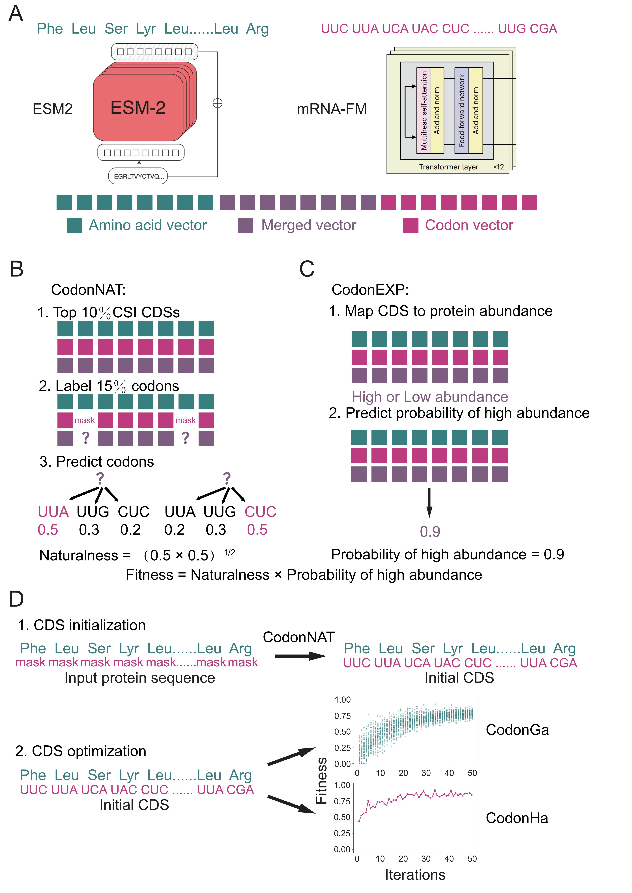

# HalluCodon: a species-specific codon optimizer guided by multimodal language models and hallucination design


<!-- TABLE OF CONTENTS -->

<details>
  <summary>Table of Contents</summary>
  <ol>
    <li>
      <a href="#about-the-project">About The Project</a>
    </li>
    <li>
      <a href="#Installation">Installation</a>
    </li>
    <li><a href="#data-collection">Data Collection</a></li>
    <li><a href="#training">Training</a>
      <ul>
        <li><a href="#how-to-train-codonnat">How to train CodonNAT</a></li>
        <li><a href="#how-to-train-codonexp">How to train CodonEXP</a></li>
      </ul>
    </li>
    <li><a href="#usage">Usage</a></li>
  </ol>
</details>


<!-- ABOUT THE PROJECT -->

## About The Project

HalluCodon is a species-specific codon optimization framework designed for plant expression systems. It integrates pre-trained protein (ESM2) and RNA (mRNA-FM) language models, applying supervised fine-tuning on species-specific datasets to generate coding sequences optimized for improved protein expression.



<!-- Installation -->

## Installation


### 1. Create a conda environment

   ```sh
   conda create -n HalluCodon python=3.10
   conda activate HalluCodon
   ```

### 2. Install dependencies
   ```sh
   git clone https://github.com/YuxuanLou/HalluCodon.git
   cd HalluCodon
   pip install -r requirements.txt
   wget -O multimolecule.tar.gz "https://zenodo.org/records/19807318/files/multimolecule.tar.gz?download=1"
   tar -zxvf multimolecule.tar.gz
   huggingface-cli download facebook/esm2_t33_650M_UR50D \
   --local-dir ./facebook/esm2_t33_650M_UR50D \
   --local-dir-use-symlinks False
   ```


<!-- DATA COLLECTION -->

## Data Collection

Both models are species-specific and must be fine-tuned on target-species data
before they can be used by the optimizers. Two datasets are needed:

* **CodonNAT** (naturalness encoder) — natural coding sequences of the species.
* **CodonEXP** (expression classifier) — CDS paired with measured protein abundance,
  binarized into high / low expressors.

### CodonNAT training data (high-CSI CDS)

Goal: a CSV of the species' most naturally-optimized CDS (top 10% by Codon
Stability Index, CSI), in **RNA alphabet (U)**.

```
cds_sequence,protein_sequence,csi_value
AUGAAACGC...,MKRISTTT...,0.31
```

The one-command pipeline downloads a taxon's reference CDS from NCBI, translates
and de-duplicates by protein, builds a genome-wide codon-frequency table, ranks CDS
by CSI against that table, keeps the top percentage, and converts T→U:

```sh
cd data_preparation/CodonNAT_data_generate
./02_build_top10_U.sh Escherichia            # taxon name (e.g. a genus or family)
# output:  output/top10_U.csv   (cds_sequence,protein_sequence,csi_value)
# options: -p <percent>  -j <jobs>  -a <assembly_summary.txt>  -o <outdir>
```

Dependencies: `python3` + `pandas`/`biopython`, `blastn`/`makeblastdb` (for protein
de-duplication), `cd-hit`. NCBI `assembly_summary_genbank.txt` and the taxonomy dump
(`nodes.dmp`/`names.dmp`) are downloaded automatically on first run.

Step-by-step scripts (for a local genome FASTA instead of NCBI download):

| Script | Role |
|---|---|
| `data_preparation/filter_cds.py` | keep complete CDS (ATG…stop, length % 3 == 0) |
| `data_preparation/count_codon_freq.py` | genome-wide `aa,codon,count,frequency(%)` table |
| `get_high_csi-seq.py` | rank CDS by CSI vs that table, keep top 10% |

### CodonEXP training data (expression-labeled CDS)

Goal: a CSV of CDS labeled high(1) / low(0) by measured abundance, protein
de-duplicated at 90% identity:

```
id,abundance,protein_sequence_ori,uniprot_id,exp,label,cds_sequence,protein_sequence,similarity,coverage
```

PaxDb protein-abundance datasets are matched back to the species CDS by BLASTP and
de-duplicated with cd-hit. The workflow is documented in
[`data_preparation/CodonEXP_data_generate/README.md`](data_preparation/CodonEXP_data_generate/README.md).

```sh
cd data_preparation/CodonEXP_data_generate
# 1) species proteins  (taxid 3702 = Arabidopsis thaliana)
./get-paxdb-proteins.sh 3702 fasta.v11.5.3702.fa
# 2) pick a dataset (list, then download one)
./get-paxdb-dataset.sh 3702 FLOWER-integrated 3702-FLOWER-integrated.txt
# 3) abundance -> high/low + CDS matching + 0.9 de-duplication
python3 paxdb-codonexp.py \
    --cds Athaliana.TAIR10.cds.all.fa \
    --dataset 3702-FLOWER-integrated.txt \
    --proteins fasta.v11.5.3702.fa \
    --out 3702-FLOWER-0.9.csv \
    --threshold 90 --coverage 50 --parallel 8
```

The abundance ranking marks the **top 1/3 as `high` (label=1)** and the
**bottom 1/3 as `low` (label=0)**, dropping the middle third; proteins are then
de-duplicated with `cd-hit -c 0.9 -n 5`. Dependencies: `pandas`, `biopython`,
`blastp`, `makeblastdb`, `cd-hit`.

<!-- TRAINING -->

## Training

### How to train CodonNAT

CodonNAT is a self-supervised masked-codon language model. It is fine-tuned on the
species' high-CSI CDS so the downstream optimizers (CodonIni / CodonGa / CodonHa)
can score codon naturalness for that species.

```sh
python train_and_test/CodonNAT_train.py \
    --output_dir ./Ntabacum4097 \
    --dataset_path ./Ntabacum4097_top10.csv \
    --model_name Ntabacum4097-CodonNAT
```

| Argument | Meaning |
|---|---|
| `--output_dir` | directory for logs and the trained model |
| `--dataset_path` | high-CSI CDS CSV (`cds_sequence,protein_sequence`); split 80/10/10 train/val/test, `random_state=42` |
| `--model_name` | saved as `{output_dir}/{dataset_name}-{model_name}/` |

| Component | Setting |
|---|---|
| CDS encoder | mRNA-FM (`multimolecule/mrnafm`, codon tokens) — pretrained, fine-tuned at lr 1e-4 |
| Protein encoder | ESM2-650M (`facebook/esm2_t33_650M_UR50D`) — pretrained, fine-tuned at lr 1e-4 |
| Task | masked codon prediction (MLM), codon level |
| Loss | cross-entropy on masked codons |
| Optimizer | AdamW, lr 1e-4, weight decay 0.01 (both parameter groups) |
| Batch / length / epochs | 4 per device · 1024 tokens · 50 (early stop patience 5) |
| Best-model selection | `eval_mask_accuracy` (final weights saved as `model.safetensors`, no optimizer state) |

### How to train CodonEXP

CodonEXP is the high/low expression classifier: an ESM2 branch and an mRNA-FM
branch (both initialized from pretrained weights and fine-tuned at a low learning
rate), fused with learned weights and read out by an MLP with a binary (BCE) head.
It is trained with **5-fold cross-validation**, and the five fold models are later
averaged (ensemble) for inference.

```sh
python train_and_test/CodonEXP_train_and_test.py \
    --output_dir ./Ntabacum4097-CodonEXP \
    --dataset_path ./Ntabacum4097-0.9.csv
```

| Argument | Meaning |
|---|---|
| `--output_dir` | directory for logs and the five fold models |
| `--dataset_path` | expression-labeled CSV (`cds_sequence,protein_sequence,label`) |

| Component | Setting |
|---|---|
| Data split | 80/20 train/test (`test_size=0.2, random_state=42, stratify=label`), then 5-fold CV on the 80% (`KFold(5, shuffle, random_state=100)`) |
| CDS encoder | mRNA-FM — pretrained, fine-tuned at lr 1e-5 |
| Protein encoder | ESM2-650M — pretrained, fine-tuned at lr 1e-5 (same low-lr group) |
| Fusion | learnable softmax weights (RNA vs protein) reported per fold |
| Head | AttentionPooling → MLP → 1 logit, `BCEWithLogitsLoss` |
| Loss | main loss + equal-weight auxiliary loss on the CDS branch |
| Batch / length / epochs | 4 (eval 16) per device · 1024 tokens · 20 |
| Best-model selection | validation `f1` (saved as `classification-model-fold-{1..5}`) |

The script also reports an ensemble (average probability over the five folds) on
the held-out 20% test set. For tissue-specific or single-model training without CV,
use `train_and_test/CodonEXP_train_single_tissue.py` (same flags; keeps one
`classification-model/`).

<!-- USAGE EXAMPLES -->

## Usage

### 1. Initialize CDS

   ```sh
   python CodonIni.py \
   --model_path ./plantmodel/Ntabacum4097/Ntabacum4097-CodonNAT \
   --input_file ./input_pro.fasta \
   --output_file ./CodonIni.fasta
   ```
  **--model_path** The path where the trained species-specific CodonNAT model is stored.
  
  **--input_file** The amino acid sequence prepared for codon optimization. Input must be in standard FASTA format with a header line starting with ">" (e.g., ">RFP").
  
  **--output_file** The CDS obtained from the CodonIni step will be written into this file.

### 2. Optimize CDS with CodonGa

   ```sh
   python CodonGa.py \
   --CodonEXP_model_dir ./Ntabacum4097/Ntabacum4097-CodonEXP \
   --population_size 100 \
   --mutation_rate 0.05 \
   --crossover_rate 0.7 \
   --max_generations 100 \
   --batch_size 50 \
   --selection_top_percent 0.2 \
   --top_n 1 \
   --results ./results \
   --history ./history \
   --naturalness_weight 1 \
   --CodonNAT_model_dir ./Ntabacum4097/Ntabacum4097-CodonNAT \
   --input ./CodonIni.fasta \
   --output ./CodonGa.fasta
   ```

   **--CodonEXP_model_dir** The path where the trained species-specific CodonEXP model is stored.
   
   **--CodonNAT_model_dir** The path where the trained species-specific CodonNAT model is stored.
   
   **--naturalness_weight** Weight of naturalness in fitness calculation. The fitness calculation formula is: fitness = high-expression probability × (naturalness ^ this weight). A larger weight means naturalness has a more significant impact on fitness.
   
   **--population_size** The population size in the genetic algorithm, which refers to the number of sequences included in each generation. A larger population size may increase diversity but also raises computational costs.
   
   **--mutation_rate** The probability of synonymous substitution occurring at each codon in the sequence. The larger the value of this parameter, the greater the sequence variation between generations.
   
   **--crossover_rate** Controls the probability that parent sequences produce offspring through crossover operations. The larger the value of this parameter, the greater the sequence variation between generations.
   
   **--max_generations** The maximum number of iterations in the genetic algorithm.
   
   **--batch_size** Batch size for model prediction. When calculating high protein abundance probability and naturality, sequences will be grouped into batches of this size for model input, balancing computational efficiency and memory usage.
   
  **--selection_top_percent** The proportion of high-fitness sequences retained during the selection operation in the genetic algorithm.
  
  **--top_n** Number of optimal sequences to return after optimization (sorted by fitness).
  
  **--results** The storage path for detailed results.
  
  **--history** The storage path for the optimization history.
  
  **--input** This file needs to contain the CDS obtained from the CodonIni step. Input must be in standard FASTA format with a header line starting with ">" (e.g., ">RFP").
  
  **--output** The CDS obtained from the CodonGa step will be written into this file.

### 3. Optimize CDS with CodonHa

   ```sh
   python CodonHa.py \
   --CodonEXP_model_dir ./Ntabacum4097/Ntabacum4097-CodonEXP \
   --mutation_rate 0.15 \
   --iterations 16 \
   --max_iterations 96 \
   --min_expression_threshold 0.9 \
   --min_naturalness_threshold 0.6 \
   --batch_size 16 \
   --top_n 1 \
   --results_dir ./results \
   --naturalness_weight 1 \
   --hallucination_naturalness_weight 1 \
   --patience 20 \
   --CodonNAT_model_dir ./Ntabacum4097/Ntabacum4097-CodonNAT \
   --input ./CodonIni.fasta \
   --output ./CodonHa.fasta \
   --codon_frequency_file ./codon_freq/Tobacco-codon-count.csv
   ```

   **--CodonEXP_model_dir** The path where the trained species-specific CodonEXP model is stored.
   
   **--CodonNAT_model_dir** The path where the trained species-specific CodonNAT model is stored.
   
   **--naturalness_weight** Weight of naturalness in fitness calculation. The fitness calculation formula is: fitness = high-expression probability × (naturalness ^ this weight). A larger weight means naturalness has a more significant impact on fitness.
   
   **--mutation_rate** Proportion of codons allowed to mutate in each iteration (relative to total codon count), controlling the intensity of single mutation.
   
   **--iterations** Number of iterations for gradient-guided mutation in each generation, sequence performance is evaluated after each generation.
   
   **--max_iterations** Maximum number of iterations.
   
   **--min_expression_threshold** Expression threshold for early stopping mechanism: optimization can terminate early if the best sequence expression exceeds this value.
   
   **--min_naturalness_threshold** Naturality threshold for early stopping mechanism: optimization can terminate early if the best sequence naturality exceeds this value.
   
   **--batch_size** Batch size for model prediction. When calculating high protein abundance probability and naturality, sequences will be grouped into batches of this size for model input, balancing computational efficiency and memory usage.
   
   **--top_n** Number of optimal sequences to return after optimization (sorted by fitness).
   
   **--results_dir** The storage path for detailed results and optimization history.
   
   **--naturalness_weight** Weight of naturalness in fitness calculation. The fitness calculation formula is: fitness = high-expression probability × (naturalness ^ this weight). A larger weight means naturalness has a more significant impact on fitness.
   
   **--hallucination_naturalness_weight** Weight of naturalness in mutation gain calculation, adjusting the impact of naturalness on mutation selection.
   
   **--patience** Early stopping mechanism parameter: under the premise of meeting high-expression probability and naturalness thresholds, if no better solution is found for this number of consecutive iterations, optimization will terminate early.
   
   **--input** This file needs to contain the CDS obtained from the CodonIni step. Input must be in standard FASTA format with a header line starting with ">" (e.g., ">RFP").
  
  **--output** The CDS obtained from the CodonHa step will be written into this file.
  
  **--codon_frequency_file** Species-specific codon usage frequency file.
  
  ### 4. Optimize CDS with Ha-GC3

   ```sh
   python Ha-GC3.py \
   --CodonEXP_model_dir ./Ntabacum4097/Ntabacum4097-CodonEXP \
   --mutation_rate 0.15 \
   --iterations 16 \
   --max_iterations 96 \
   --min_expression_threshold 0.9 \
   --min_naturalness_threshold 0.6 \
   --batch_size 16 \
   --top_n 1 \
   --results_dir ./results \
   --naturalness_weight 1 \
   --hallucination_naturalness_weight 1 \
   --patience 20 \
   --CodonNAT_model_dir ./Ntabacum4097/Ntabacum4097-CodonNAT \
   --input ./CodonIni.fasta \
   --output ./Ha-GC3.fasta \
   --gc3_weight 5
   ```

   **--gc3_weight** Adjusts the GC3 content of the generated sequences. When this value is greater than 1, the use of GC3 codons is encouraged; otherwise, the use of GC3 codons is reduced.


## Optional Species
We trained the CodonNAT and CodonEXP models separately on 15 plant species. The species names and their corresponding weight storage paths are as follows:
Arabidopsis(https://zenodo.org/records/19126265), Canola(https://zenodo.org/records/19129186), Sweet orange(https://zenodo.org/records/19133772), Cotton(https://zenodo.org/records/19135167), Soybean(https://zenodo.org/records/19135889), Barley(https://zenodo.org/records/19136614), Medicago(https://zenodo.org/records/19143273), Tobacco(https://zenodo.org/records/19143653), Rice(https://zenodo.org/records/19144006), Earthmoss(https://zenodo.org/records/19144435), Tomato(https://zenodo.org/records/19150439), Potato(https://zenodo.org/records/19150918), Wheat(https://zenodo.org/records/19151412), Grape(https://zenodo.org/records/19151918), Maize(https://zenodo.org/records/19152348).


